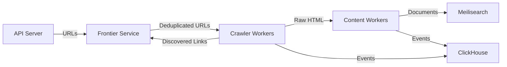

# Architecture

Scrapix is a distributed system built from five Rust services that communicate via a message bus. In single-binary mode, the bus is in-process channels. In distributed mode, it's Kafka/Redpanda.

## Data Flow



### Step by Step

1. **API Server** receives a crawl request with start URLs and configuration
2. **Frontier Service** deduplicates URLs using bloom filters and SimHash/MinHash, assigns priorities, and dispatches URLs in batches partitioned by domain
3. **Crawler Workers** fetch pages via HTTP (or headless browser for JS-rendered sites), extract links, and publish the raw HTML
4. **Content Workers** parse HTML, extract content using readability algorithms, convert to markdown, extract structured data (JSON-LD, microdata), and index documents to Meilisearch
5. Discovered links flow back to the Frontier for deduplication and scheduling

## Services

| Service | Binary | Purpose | Stateful? |
|---------|--------|---------|-----------|
| API Server | `scrapix api` | REST API, WebSocket, job management | No |
| Frontier | `scrapix frontier` | URL deduplication, priority scheduling, rate limiting | In-memory (bloom filters) |
| Crawler | `scrapix crawler` | HTTP fetching, link extraction, robots.txt | RocksDB (URL cache, DNS, robots) |
| Content | `scrapix content` | HTML parsing, extraction, Meilisearch indexing | No |
| All-in-One | `scrapix all` | All services in a single process | RocksDB |

## Message Topics

All inter-service communication flows through these topics:

| Topic | Producer | Consumer | Purpose |
|-------|----------|----------|---------|
| `scrapix.urls.frontier` | API | Frontier | New URLs to crawl |
| `scrapix.urls.processing` | Frontier | Crawler | Ready-to-fetch URLs |
| `scrapix.pages.raw` | Crawler | Content | Raw HTML pages |
| `scrapix.documents` | Content | — | Processed documents (optional) |
| `scrapix.events` | All | Analytics | Crawl events for monitoring |
| `scrapix.dlq.urls` | All | — | Dead letter queue for failed messages |
| `scrapix.jobs.status` | All | API | Job status updates |
| `scrapix.links` | Crawler | Frontier | Link graph updates |
| `scrapix.crawl.history` | Crawler | Frontier | Incremental crawl tracking |

## Single Binary vs Distributed

### Channel Bus (Single Binary)

When you run `scrapix all`, services communicate via bounded async channels (`async-channel` crate):

- **Capacity:** 50,000 messages per topic
- **Ordering:** FIFO per topic
- **Latency:** Sub-microsecond (in-process)
- **Partitioning:** Single partition (no domain-based partitioning)

No external message broker needed. All state lives in a single process.

```bash
# Minimal deployment — only needs Meilisearch
scrapix all \
  --meilisearch-url http://localhost:7700 \
  --meilisearch-key masterKey
```

### Kafka Bus (Distributed)

When services run independently, they communicate via Kafka/Redpanda:

- **Producer:** LZ4 compression, idempotent writes, 20ms batching
- **Consumer:** Manual commits, earliest offset reset, 500ms fetch wait
- **Partitioning:** Domain-based keys for URL ordering per domain

```bash
# Each service runs separately
scrapix api --brokers kafka:9092
scrapix frontier --brokers kafka:9092
scrapix crawler --brokers kafka:9092
scrapix content --brokers kafka:9092 --meilisearch-url http://meilisearch:7700
```

## Near-Duplicate Detection

The frontier uses dual locality-sensitive hashing to avoid crawling near-duplicate pages:

- **SimHash:** 64-bit fingerprints, Hamming distance threshold of ~10 bits for quick similarity checks
- **MinHash:** 128 hash functions, Jaccard similarity threshold of ~0.8 for accurate duplicate detection

## Storage Backends

| Backend | Purpose | Required? |
|---------|---------|-----------|
| **Meilisearch** | Document indexing, full-text search | Yes |
| **RocksDB** | Per-worker URL cache, robots.txt, DNS cache | Auto-managed |
| **Redis/DragonflyDB** | Rate limiting, real-time counters | Optional |
| **ClickHouse** | Analytics, time-series metrics | Optional |
| **S3-compatible** | Raw HTML archival | Optional |
| **PostgreSQL** | User accounts, API keys | Optional |
